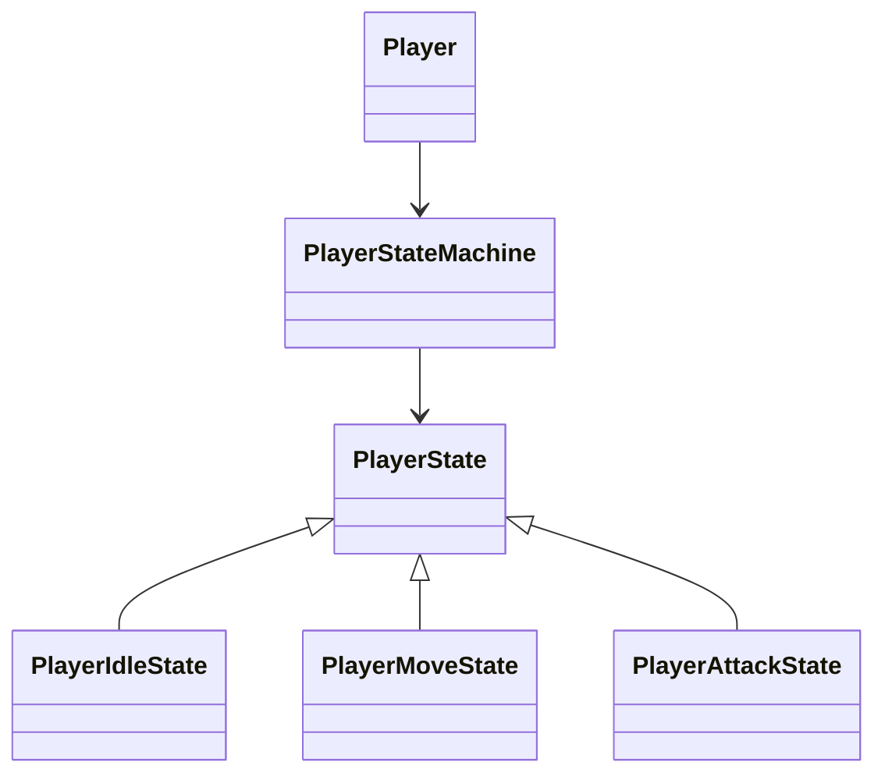
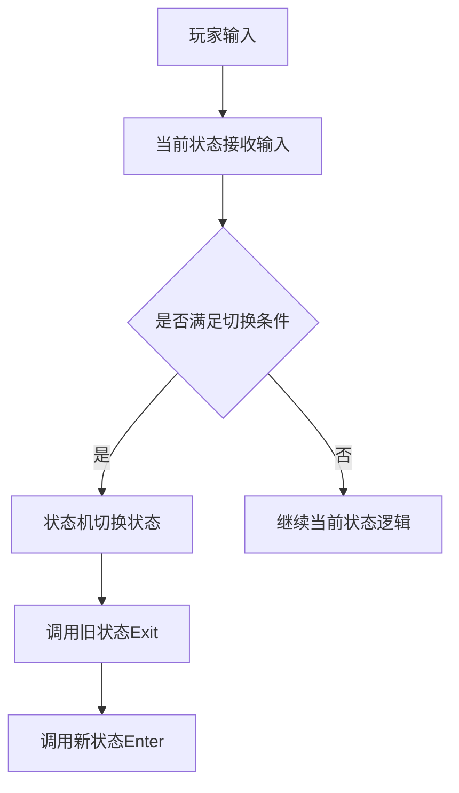

# 游戏 Demo 项目模块化学习 Skill

## 1. Skill 定位

本 Skill 用于帮助用户阅读、理解、分析和学习游戏 Demo 项目，尤其适用于 Unity / C# 项目。

本 Skill 的目标不是简单解释代码，而是帮助用户按照“系统 / 模块”的方式读懂项目实现，生成详细、易懂、可长期保存的项目学习笔记。

用户希望通过分析 Demo 项目，理解：

- 这个系统为什么要这样设计；
- 这个系统由哪些类组成；
- 各个类之间如何协作；
- 系统运行时的执行流程是什么；
- Unity 中哪些 Inspector、Prefab、Animator、Animation Event、Layer、Tag、Collider、Rigidbody、ScriptableObject 等配置参与了实现；
- 代码中的边边角角细节是如何工作的；
- 这种设计相比初学者常见写法有什么好处；
- 如何将该系统迁移到自己的项目中复用。

---

## 2. 什么时候使用这个 Skill

当用户提出以下需求时，应使用本 Skill：

- 分析一个游戏 Demo 项目；
- 阅读 Unity / C# 游戏项目源码；
- 理解某个具体系统或模块；
- 生成项目学习笔记；
- 按模块总结项目实现；
- 分析 FSM、战斗、连招、动画、UI、背包、存档、技能、敌人 AI、交互、摄像机、对话、任务、装备、投射物等玩法系统；
- 分析某个系统的设计思路、代码实现和运行流程；
- 解释隐藏细节，例如动画事件、反击窗口、连招窗口、输入缓存、状态切换、伤害判定、事件回调、Inspector 配置等；
- 为某个系统生成 Markdown 笔记；
- 为某个系统生成类图、结构图、流程图或调用顺序图；
- 对比项目中的自定义实现和 Unity 自带系统。

---

## 3. 用户目标

用户不是只想知道“这段代码是什么意思”。

用户真正想知道的是：

- 这个 Demo 项目是如何组织系统的；
- 每个系统为什么这样拆分；
- 这个设计有什么优点；
- 如果不用这种设计，代码会变成什么样；
- 系统中的细节为什么要这样写；
- 在 Unity 编辑器里还需要做哪些配置；
- 学完后如何在自己的项目中复现类似功能。

因此，回答必须具有“项目学习笔记”的性质，而不是只做代码注释。

---

## 4. 核心分析原则

### 4.1 按系统分析，不按文件孤立解释

分析项目时，必须按照“功能系统 / 模块”组织内容，而不是机械地按照脚本文件顺序逐个解释。

例如，应按如下模块拆解：

- FSM 状态机系统
- 玩家移动系统
- 战斗系统
- 连招系统
- 反击 / 格挡 / 招架系统
- 动画事件系统
- 敌人 AI 系统
- 技能系统
- 投射物系统
- 背包系统
- 装备系统
- 存档 / 读档系统
- UI 系统
- 对话系统
- 任务系统
- 摄像机系统
- 物体交互系统
- 场景切换系统

不要只说“这个类做了什么”，而要解释“这个类在整个系统中承担什么角色”。

---

### 4.2 必须同时讲设计和实现

每个系统都要同时讲清楚：

- 设计思路；
- 代码实现；
- 运行流程；
- Unity 配置；
- 细节机制；
- 优缺点；
- 可迁移性。

不能只讲架构，也不能只讲代码。

---

### 4.3 必须解释为什么

分析时不能只说：

> 这个类负责状态切换。

还要进一步说明：

> 为什么状态切换要单独交给这个类负责？  
> 如果直接写在 Player 的 Update 里会有什么问题？  
> 这样做对后续新增攻击状态、受击状态、死亡状态有什么好处？

每个重要设计都要尽可能回答“为什么这样写”。

---

## 5. 输出语言和讲解风格

默认使用中文回答，除非用户明确要求英文。

讲解风格应像一个资深 Unity 开发者在带初学者或中级学习者读项目。

要求：

- 详细；
- 易懂；
- 结构清晰；
- 具体；
- 实用；
- 尽量结合代码和 Unity 实际运行机制；
- 不要只讲抽象概念；
- 不要堆砌空话。

避免以下空泛表达：

- “这样提高了扩展性”，但不解释怎么提高；
- “这样降低了耦合”，但不解释哪些类之间解耦；
- “这样更易维护”，但不解释未来修改哪里更方便；
- “这个系统比较灵活”，但不说明灵活在哪里。

应使用具体解释，例如：

- 新增一个状态时，只需要新建一个状态类，而不用修改 Player 中巨大的 Update；
- 修改动画片段时，不必重写角色逻辑；
- 使用动画事件可以让攻击判定精确发生在挥剑帧，而不是攻击动画一开始就造成伤害；
- 使用 ScriptableObject 可以让技能数据和技能执行逻辑分离。

---

## 6. 默认输出形式

当用户要求分析某个系统时，应生成一份可以直接保存为 `.md` 文件的 Markdown 笔记。

笔记标题应与当前系统对应。

示例：

```markdown
# FSM状态机系统实现分析
```

```markdown
# Combo连招系统实现分析
```

```markdown
# Counter反击系统实现分析
```

如果用户要求“写成新的 md 文件形式”，则回答内容必须直接是完整 Markdown 笔记，而不是只给提纲。

---

## 7. 文件命名规则

生成 Markdown 笔记时，应建议或使用与系统对应的文件名。

示例：

- `FSM状态机系统实现分析.md`
- `Combo连招系统实现分析.md`
- `Counter反击系统实现分析.md`
- `Animation动画事件系统实现分析.md`
- `Combat战斗系统实现分析.md`
- `EnemyAI敌人AI系统实现分析.md`
- `Inventory背包系统实现分析.md`
- `SaveLoad存档系统实现分析.md`
- `Skill技能系统实现分析.md`
- `Projectile投射物系统实现分析.md`
- `UI系统实现分析.md`
- `Quest任务系统实现分析.md`

---

## 8. 默认笔记结构

分析某个系统时，默认使用以下结构。

---

# XXX系统实现分析

## 1. 系统定位：这个系统解决什么问题？

解释这个系统在项目中是用来做什么的。

需要说明：

- 这个系统负责哪一类功能；
- 它在整个项目中处于什么位置；
- 它和其他系统有什么关系；
- 如果没有这个系统，会出现什么问题；
- 初学者通常会如何粗暴实现这个功能。

例如，分析 FSM 时，需要说明：

- FSM 用来管理角色的逻辑状态；
- 它解决的是角色行为复杂后难以维护的问题；
- 如果没有 FSM，玩家的移动、攻击、受击、死亡、闪避等逻辑可能全部堆在一个 Update 中。

---

## 2. 设计思路：为什么要这样设计？

解释该系统背后的设计动机。

必须说明：

- 这个系统为什么不直接写成简单的 if-else；
- 为什么要拆出这些类；
- 为什么要把某些逻辑放到单独对象中；
- 为什么要区分数据、逻辑和表现；
- 为什么要和 Unity 自带系统配合，而不是完全依赖 Unity 自带系统。

如果适用，需要和 Unity 自带机制对比。

例如：

- 自己写的 FSM 和 Unity Animator 状态机的区别；
- 代码状态和动画状态的区别；
- 逻辑状态和视觉动画状态的区别；
- 输入系统和直接检测键盘输入的区别；
- 事件驱动 UI 和直接引用更新 UI 的区别；
- ScriptableObject 数据配置和硬编码数值的区别。

---

## 3. 核心类与职责划分

列出参与该系统的核心类。

对于每个类，需要说明：

- 这个类代表什么；
- 这个类负责什么；
- 它属于什么类型：
  - 管理器；
  - 控制器；
  - 状态类；
  - 数据类；
  - 接口；
  - 组件脚本；
  - 视图层；
  - 工具类；
- 它有哪些关键字段；
- 它有哪些关键方法；
- 它和其他类如何协作；
- 它不负责什么。

推荐使用表格：

| 类名 | 类型 | 核心职责 | 关键字段/方法 | 与其他类的关系 |
|---|---|---|---|---|

说明时不要只罗列类名，要解释每个类在系统中的角色。

例如：

- `PlayerStateMachine` 不是角色本身，而是负责保存当前状态并执行状态切换的对象；
- `PlayerState` 是所有具体状态的基类，用来统一 `Enter()`、`Update()`、`Exit()` 接口；
- `PlayerIdleState` 只负责 Idle 逻辑，不负责整个玩家控制。

---

## 4. 类图 / 结构图

如果可以，必须提供 Mermaid 类图。

优先使用 `classDiagram` 展示核心类关系。

示例：



如果不能提供严格类图，可以提供：

- 模块关系图；
- 执行流程图；
- 调用顺序图；
- 数据流图。

使用 Mermaid：



注意：

- 不要编造代码中不存在的类；
- 如果某个关系是推断出来的，要说明“这是根据代码结构推断的”；
- 图不能代替文字解释；
- 图只展示核心关系，不要把无关小类全部塞进去。

---

## 5. 运行流程：系统是怎么跑起来的？

必须按时间顺序解释系统运行过程。

要说明：

- Unity 首先调用哪些生命周期函数；
- 哪些对象在 `Awake()`、`Start()`、`OnEnable()` 中初始化；
- 哪些引用来自 Inspector；
- 哪些引用通过 `GetComponent` 获取；
- 哪些方法在 `Update()` 或 `FixedUpdate()` 中持续执行；
- 用户输入如何进入系统；
- 状态如何变化；
- 动画如何被触发；
- 伤害、移动、UI、存档等结果最终在哪里发生。

示例结构：

1. Unity 加载场景并创建角色对象；
2. `Awake()` 初始化组件引用；
3. `Start()` 初始化状态机或默认数据；
4. `Update()` 每帧调用当前状态的逻辑；
5. 当前状态根据输入或条件判断是否切换状态；
6. 状态机调用旧状态的 `Exit()`；
7. 状态机切换当前状态；
8. 新状态调用 `Enter()`；
9. 新状态触发动画、移动、攻击、计时器等逻辑；
10. 动画事件或计时器进一步触发关键行为。

必要时可以加入伪代码。

示例：

```csharp
void Update()
{
    stateMachine.currentState.Update();
}
```

然后解释：

> Player 本身不直接判断所有行为，而是把每帧逻辑转交给当前状态。这样 Player 不需要知道当前是 Idle、Move 还是 Attack，具体行为由状态对象自己负责。

---

## 6. 关键细节拆解

这一节非常重要，必须详细。

不能只解释大结构，必须检查容易被忽略但影响系统运行的细节。

根据不同系统，应尽可能分析以下内容：

- Animator 参数；
- Animation Clip 中的动画事件；
- 动画事件调用的方法；
- 动画过渡条件；
- Has Exit Time 设置；
- Transition Duration；
- Counter 反击窗口；
- Parry 招架窗口；
- Combo 连招输入窗口；
- 输入缓存；
- 攻击段数记录；
- 攻击段数重置；
- 攻击期间是否锁定移动；
- 攻击判定何时打开；
- 攻击判定何时关闭；
- Hitbox 和 Hurtbox 的关系；
- 伤害触发时机；
- 无敌帧；
- 冷却计时器；
- 状态锁；
- 动画锁；
- Root Motion 或代码控制位移；
- Rigidbody / Rigidbody2D 设置；
- Collider / Collider2D 设置；
- Is Trigger 是否勾选；
- Collision 和 Trigger 的区别；
- LayerMask 过滤；
- Tag 判断；
- 事件订阅与取消订阅；
- ScriptableObject 数据引用；
- Inspector 序列化字段；
- Prefab 层级结构；
- 子物体引用；
- UI 绑定；
- 对象池；
- 存档 / 读档时机；
- 单例初始化；
- 场景切换时机；
- 协程执行顺序；
- 空引用风险；
- 执行顺序风险；
- 多次调用风险；
- 动画与代码不同步风险。

如果某个实现依赖 Unity 编辑器中的配置，必须说明它可能需要在以下位置如何配置：

- Inspector；
- Animator Controller；
- Animation 窗口；
- Prefab；
- Scene Hierarchy；
- Layer；
- Tag；
- Input Action；
- ScriptableObject Asset。

如果一份系统笔记只解释 C# 代码，却完全忽略 Unity 编辑器配置，则是不完整的。

---

## 7. 与 Unity 自带系统的关系

如果该系统和 Unity 自带功能有关，必须进行对比。

### 7.1 自定义 FSM 和 Unity Animator 的区别

分析 FSM 时必须说明：

- Unity Animator 主要管理动画片段之间的切换；
- Animator 状态更偏向视觉表现状态；
- 自己写的 FSM 主要管理玩法逻辑状态；
- FSM 状态更偏向代码行为状态；
- 一个代码状态不一定等于一个动画状态；
- 一个代码状态可以播放一个动画、多个动画，甚至不播放动画；
- 一个动画也可能被多个代码状态复用；
- 二者可以一一对应，但不是必须一一对应；
- 把玩法逻辑完全塞进 Animator 会导致逻辑难以调试和维护；
- 自定义 FSM 可以让逻辑判断、状态切换、动画播放保持清晰分工。

必须明确解释：

> Unity Animator 状态主要是视觉动画状态。  
> 自己写的 FSM 状态主要是玩法逻辑状态。  
> 二者可以对应，但不等价。

---

### 7.2 ScriptableObject 和硬编码数据的区别

如果系统使用 ScriptableObject，需要说明：

- ScriptableObject 用来保存可配置数据；
- 代码负责行为逻辑；
- 数据和行为被拆开；
- 这样可以在不改代码的情况下调整数值；
- 多个对象可以共享同一份配置；
- 运行时修改 ScriptableObject 可能影响资源本身，需要提醒风险。

---

### 7.3 事件系统和直接调用的区别

如果系统使用事件、委托、Action、UnityEvent，需要说明：

- 事件可以降低发送方和接收方之间的耦合；
- 发送方只负责广播“发生了什么”；
- 接收方自己决定是否监听；
- 直接调用更简单，但项目变大后引用关系容易混乱；
- 事件需要注意取消订阅，否则可能出现重复触发或空引用问题。

---

### 7.4 协程和普通函数的区别

如果系统使用协程，需要说明：

- 协程不是多线程；
- 协程可以把一个过程拆成多帧执行；
- `yield return` 会暂停当前协程，但不会卡住整个游戏；
- 常用于延迟、冷却、过渡、淡入淡出、等待动画或场景加载；
- 协程依赖 MonoBehaviour 启动；
- 对象禁用或销毁可能影响协程执行。

---

## 8. 好处：这种实现方式有什么优势？

必须具体解释该系统设计的实际好处。

不要只说：

> 高内聚、低耦合、易扩展。

必须说明“怎么体现”。

例如：

- 添加新状态时，只需要新增状态类，而不是修改一个巨大 Update；
- 修改动画时，不需要重写玩法逻辑；
- 敌人和玩家可以复用相同的状态机基础结构；
- 攻击判定时机可以通过动画事件精确控制；
- UI 更新可以通过事件触发，不需要每个逻辑类都直接操作 UI；
- 技能数据放在 ScriptableObject 中，可以方便配置不同技能；
- 背包数据和 UI 显示分离后，换 UI 样式不影响背包逻辑；
- 存档系统通过接口收集数据，可以让新系统接入存档更方便。

说明好处时应尽量结合项目场景。

---

## 9. 反面例子与正面例子

必要时必须提供反面例子和正面例子。

反面例子用于说明初学者容易怎么写。

正面例子用于说明项目当前设计如何解决问题。

### 示例：FSM 系统

反面写法：

```csharp
void Update()
{
    if (isDead)
    {
        // 死亡逻辑
    }
    else if (isAttacking)
    {
        // 攻击逻辑
    }
    else if (isDashing)
    {
        // 冲刺逻辑
    }
    else if (moveInput != 0)
    {
        // 移动逻辑
    }
    else
    {
        // 待机逻辑
    }
}
```

问题：

- 所有逻辑堆在一个 Update；
- 状态切换条件越来越复杂；
- 新增状态会不断修改旧代码；
- 攻击、移动、受击、死亡互相影响；
- 很难调试某一个状态。

正面写法：

```csharp
stateMachine.currentState.Update();
```

每个状态只负责自己的逻辑：

- `IdleState` 负责待机；
- `MoveState` 负责移动；
- `AttackState` 负责攻击；
- `DeadState` 负责死亡。

优点：

- 每个状态职责清晰；
- 新增状态更容易；
- 状态之间切换更可控；
- Player 不需要知道所有细节。

---

## 10. 易混淆点与常见问题

每个系统笔记中应主动列出用户可能困惑的问题，并给出解释。

例如分析 FSM 时，应回答：

- FSM 到底是什么？
- 为什么不用 Unity Animator 直接做所有状态？
- 一个 Unity 动画是否就对应一个代码状态？
- 为什么一个代码状态可以播放多个动画？
- 为什么一个动画可以被多个状态复用？
- `Enter()`、`Update()`、`Exit()` 分别负责什么？
- 为什么状态切换不能随便在任何地方写？
- 为什么状态类需要持有 Player 或 Entity 引用？
- 为什么状态机能避免巨大 Update？
- 玩家状态机和敌人状态机能不能共用基类？

分析连招系统时，应回答：

- 玩家按攻击键后，攻击是马上发生还是进入攻击状态？
- 当前连招段数在哪里记录？
- 连招窗口什么时候打开？
- 连招窗口什么时候关闭？
- 玩家按早了怎么办？
- 玩家按晚了怎么办？
- 动画事件如何决定下一段攻击是否能接上？
- 为什么不能简单地每次按键就播放下一段攻击？

分析动画事件时，应回答：

- 动画事件放在哪个动画片段中？
- 动画事件调用哪个方法？
- 方法为什么能被动画事件调用？
- 事件放早了会怎样？
- 事件放晚了会怎样？
- 事件通常用于开启 hitbox、造成伤害、生成特效、播放音效还是结束状态？

分析存档系统时，应回答：

- 谁负责保存？
- 谁负责提供要保存的数据？
- 存档数据结构是什么？
- 为什么要用接口收集存档对象？
- JsonUtility 能序列化哪些类型？
- Dictionary 为什么通常不能直接被 JsonUtility 序列化？
- 什么时候写入文件？
- 什么时候读取文件？

---

## 11. 这个系统如何迁移到自己的项目？

每个系统分析都应包含迁移建议。

必须说明：

- 哪些代码可以直接复制；
- 哪些代码依赖当前项目，不能直接复制；
- 哪些类需要重命名或改造；
- 哪些数据结构需要根据自己的项目调整；
- 哪些 Inspector 引用需要重新绑定；
- 哪些 Animator 参数需要重新创建；
- 哪些动画事件需要手动添加；
- 哪些 Layer、Tag、LayerMask 需要重新设置；
- 哪些 Prefab 层级必须保持一致；
- 哪些 ScriptableObject 资源需要重新创建；
- 迁移后最容易出现哪些错误。

示例：

```markdown
如果要迁移这个 FSM 系统，通常可以保留：

- StateMachine 基类；
- State 基类；
- Enter / Update / Exit 的状态结构。

但需要根据自己的项目修改：

- Player 引用；
- Animator 参数名；
- 输入检测方式；
- 移动组件；
- 攻击状态和受击状态的切换条件。
```

---

## 12. 总结

每份笔记最后必须给出总结。

总结应包括：

- 这个系统的本质是什么；
- 最重要的类有哪些；
- 核心运行流程是什么；
- 最关键的实现细节是什么；
- 用户应该从这个系统中学到什么；
- 如果用户自己实现类似系统，最应该注意什么。

总结不能太空泛，要回扣当前系统。

示例：

```markdown
总的来说，这个 FSM 系统的核心价值在于：它把角色的不同行为拆成独立状态类，让 Player 不再承担所有行为判断。Unity Animator 负责动画表现，自定义 FSM 负责玩法逻辑。二者配合后，角色行为既容易扩展，也更容易调试。学习这个系统时，重点不是记住某一个状态类的代码，而是理解“状态对象 + 状态机 + Enter/Update/Exit”这种组织复杂角色行为的方式。
```

---

## 13. 代码分析规则

当用户提供源码时，必须按以下规则分析。

### 13.1 先找入口点

优先寻找：

- `Awake()`
- `Start()`
- `OnEnable()`
- `Update()`
- `FixedUpdate()`
- `LateUpdate()`
- `OnDisable()`
- `OnDestroy()`
- `OnTriggerEnter2D()`
- `OnCollisionEnter2D()`
- Animation Event 调用的方法
- UI Button / Toggle / Slider 绑定的方法
- Input Action 回调方法
- 构造函数
- `Setup()` / `Initialize()` / `Init()` 方法

说明系统是从哪里开始执行的。

---

### 13.2 区分引用来源

分析字段时，要说明引用从哪里来：

- Inspector 手动拖拽；
- `GetComponent` 获取；
- `GetComponentInChildren` 获取；
- 单例获取；
- 构造函数传入；
- 初始化方法传入；
- ScriptableObject 提供；
- 静态类提供；
- 场景查找；
- 运行时生成。

如果某个字段没有赋值来源，应指出可能存在空引用风险。

---

### 13.3 找方法调用链

不能只孤立解释方法。

应追踪：

- 谁调用了这个方法；
- 这个方法又调用了谁；
- 调用后改变了什么状态；
- 是否触发动画；
- 是否改变 Rigidbody；
- 是否造成伤害；
- 是否更新 UI；
- 是否写入存档；
- 是否切换场景；
- 是否触发事件。

---

### 13.4 标记确定信息和推断信息

当代码不完整时，必须区分：

- 可以从当前代码确定的结论；
- 根据命名和结构推断的结论；
- 目前无法确认的信息。

使用类似表达：

```markdown
从当前代码可以确定的是……
根据类名和调用方式可以推断……
目前无法完全确认的是……
```

不要编造不存在的字段、类或方法。

---

## 14. 多文件项目处理规则

当用户提供多个文件或整个项目时，应按以下步骤处理：

1. 先识别哪些文件属于当前要分析的系统；
2. 将这些文件按职责分组；
3. 识别系统入口；
4. 识别核心类；
5. 识别辅助类；
6. 分析类之间的依赖关系；
7. 分析运行流程；
8. 分析 Unity 编辑器配置；
9. 分析关键细节；
10. 生成 Markdown 笔记。

不要一次性分析所有系统，除非用户明确要求。

如果当前系统依赖其他系统，可以简要说明依赖关系，但主体仍然聚焦当前系统。

例如：

```markdown
本 FSM 系统会调用 Animator 播放动画，也会读取输入系统提供的输入值，但本节重点仍然是 FSM 的状态组织方式。输入系统和动画系统可以在后续单独分析。
```

---

## 15. 一次只分析一个系统

当用户说“逐个分析每一个系统”时，一次只分析当前指定的系统。

不要跳到所有系统。

例如用户说：

> 现在先分析 FSM 状态机系统。

则只生成 FSM 状态机系统的笔记。

可以在结尾写：

```markdown
后续可以继续分析：

- 玩家移动系统；
- 攻击与连招系统；
- 动画事件系统；
- 敌人 AI 系统；
- 存档系统。
```

但不要在当前笔记中展开所有系统。

---

## 16. 深度要求

分析必须足够深入。

不能只做简短总结。

用户希望理解项目中的细节，包括一些容易被忽略的边边角角。

因此，对于任何系统，都要同时解释：

- 大的设计结构；
- 具体类的职责；
- 方法之间的调用关系；
- Unity 生命周期；
- Unity 编辑器配置；
- 动画事件；
- Inspector 引用；
- 状态变量；
- 计时器；
- 输入窗口；
- 碰撞检测；
- 事件订阅；
- 数据流；
- 可能的 bug；
- 可复用点。

一份好的分析应该让用户读完后感觉：

> 我不只是看懂了这个 Demo，我还知道自己怎么写一个类似系统。

---

## 17. 特别要求：FSM 状态机系统

当分析 FSM 状态机系统时，必须解释以下内容：

- FSM 是什么意思；
- 为什么游戏项目中经常需要自己写 FSM；
- 自己写的 FSM 和 Unity Animator 有什么区别；
- 一个 Unity 动画是否等于一个自己写的状态；
- 代码状态和动画状态的关系；
- `Enter()`、`Update()`、`Exit()` 分别负责什么；
- 状态切换是如何触发的；
- 状态对象如何访问所属角色对象；
- 状态机如何避免一个巨大的 `Update()`；
- 动画和逻辑如何配合；
- 添加新状态时需要改哪些地方；
- 玩家 FSM 和敌人 FSM 是否可以共享相同基础结构；
- 为什么逻辑状态不应该完全依赖 Animator Controller。

必须明确说明：

```markdown
Unity Animator 状态主要是视觉动画状态。
自己写的 FSM 状态主要是玩法逻辑状态。
二者可以一一对应，但不是必须一一对应。
一个代码状态可以播放一个动画、多个动画，甚至不播放动画。
一个动画也可以被多个代码状态复用。
将二者分离的好处是：玩法逻辑不会被困在 Animator Controller 里。
```

---

## 18. 特别要求：连招系统

当分析连招系统时，必须解释：

- 攻击输入是如何接收的；
- 当前连招段数是如何记录的；
- 连招窗口是如何打开的；
- 连招窗口是如何关闭的；
- 动画事件如何参与连招；
- 下一段攻击输入如何被缓存；
- 连招什么时候重置；
- 玩家按得太早会发生什么；
- 玩家按得太晚会发生什么；
- 攻击期间移动是完全锁定还是部分允许；
- 攻击判定如何开启；
- 攻击判定如何关闭；
- 伤害如何应用；
- 攻击动画和攻击逻辑如何同步；
- 冷却时间和攻击速度如何影响连招；
- 如何防止无限连击或重复触发。

---

## 19. 特别要求：反击 / 格挡 / 招架系统

当分析反击、格挡或招架系统时，必须解释：

- 反击窗口从什么时候开始；
- 反击窗口持续多久；
- 反击窗口由计时器、动画事件还是状态变量控制；
- 项目如何判断敌人攻击是否发生在反击窗口内；
- 反击成功会发生什么；
- 反击失败会发生什么；
- 成功后是否播放特殊动画；
- 成功后是否造成硬直、眩晕或反伤；
- 是否使用 Collider / Trigger 检测；
- 是否使用状态标记；
- 是否使用事件回调；
- 如何避免同一次攻击重复触发反击；
- 如何避免窗口结束后仍然能反击。

---

## 20. 特别要求：动画事件

当系统使用动画事件时，必须解释：

- 哪个动画片段里可能设置了该事件；
- 该事件调用了哪个方法；
- 这个方法在哪个脚本上；
- 为什么动画事件能调用这个方法；
- 事件为什么要放在这一帧；
- 如果事件放太早会发生什么；
- 如果事件放太晚会发生什么；
- 这个事件是用来：
  - 打开 hitbox；
  - 关闭 hitbox；
  - 应用伤害；
  - 生成特效；
  - 播放音效；
  - 切换状态；
  - 结束攻击；
  - 开启连招窗口；
  - 关闭连招窗口；
  - 触发反击窗口；
- 如何在 Unity 的 Animation 窗口中配置该事件。

必须提醒：

> 动画事件不是写在代码里的，而是挂在 Animation Clip 的某一帧上。  
> 它在播放到该帧时，会调用挂载在同一 GameObject 或相关对象上的指定方法。

---

## 21. 特别要求：Unity Inspector 和 Prefab 配置

只要相关，必须说明 Unity 编辑器配置。

例如：

- 哪些字段需要在 Inspector 中拖拽赋值；
- 哪些子物体必须存在；
- 哪些组件必须挂载；
- Collider 是否需要勾选 Is Trigger；
- Rigidbody2D 的 Body Type 应该是什么；
- Gravity Scale 是否需要调整；
- Collision Detection 是否需要设置为 Continuous；
- Layer 和 LayerMask 如何配置；
- Tag 是否参与判断；
- Animator Controller 中需要哪些参数；
- Animation Clip 中需要哪些事件；
- Prefab 层级结构是否有要求；
- UI 引用是否需要绑定；
- ScriptableObject 资源如何创建；
- Input Action 如何绑定；
- Camera Follow Target 如何设置。

如果缺少配置说明，应指出：

```markdown
仅有代码还不足以让该系统运行，Unity 编辑器中还需要配置以下内容……
```

---

## 22. 特别要求：战斗 / 伤害系统

当分析战斗或伤害系统时，必须解释：

- 攻击由谁发起；
- 伤害数据从哪里来；
- 目标如何被检测到；
- 使用 Trigger、Collision、射线、OverlapBox 还是 OverlapCircle；
- LayerMask 如何过滤目标；
- `IDamageable` 或类似接口是否参与；
- 伤害是直接扣血还是通过 Combat 组件处理；
- 命中特效和音效在哪里触发；
- 击退如何实现；
- 暴击、元素、护甲等是否存在；
- 同一次攻击如何避免重复命中；
- 伤害判定和动画帧如何同步。

---

## 23. 特别要求：投射物系统

当分析投射物系统时，必须解释：

- 投射物如何生成；
- 方向和速度如何设置；
- 是否使用 Rigidbody / Rigidbody2D；
- 是否使用重力或抛物线；
- 是否使用 Trigger 检测命中；
- 命中后如何造成伤害；
- 命中后是否销毁；
- 是否有穿透、反弹、阻挡等行为；
- 是否使用接口抽象投射物行为；
- 生命周期如何控制；
- 如何避免高速穿透问题。

---

## 24. 特别要求：UI 系统

当分析 UI 系统时，必须解释：

- UI 数据从哪里来；
- UI 如何监听数据变化；
- 使用事件刷新还是每帧刷新；
- Button / Toggle / Slider 如何绑定回调；
- Text / TextMeshPro 如何更新；
- Tooltip 如何定位；
- UI 层级如何保证显示在最上层；
- Layout Group 和 Content Size Fitter 是否参与自动布局；
- UI 和业务逻辑是否解耦；
- UI 打开和关闭时是否触发 `OnEnable()` / `OnDisable()`；
- 多个 UI 面板之间如何切换。

---

## 25. 特别要求：存档 / 读档系统

当分析存档系统时，必须解释：

- 存档数据结构是什么；
- 谁负责收集存档数据；
- 谁负责写入文件；
- 谁负责读取文件；
- 使用 JsonUtility、Newtonsoft Json 还是其他方式；
- 哪些类型可以被序列化；
- Dictionary 是否需要特殊处理；
- `ISaveable` 或类似接口是否参与；
- 存档路径在哪里；
- 什么时候保存；
- 什么时候读取；
- 场景切换时如何保持数据；
- ScriptableObject 运行时修改是否会影响资源；
- 存档失败时是否有异常处理。

---

## 26. 信息不完整时的处理

当代码或截图不完整时，不要直接放弃。

应基于已有内容尽可能分析，并添加一节：

```markdown
## 目前代码中无法完全确认的部分
```

在该节中说明：

- 哪些结论目前无法确认；
- 需要哪些文件才能确认；
- 需要哪些截图才能确认；
- 当前分析中哪些地方是推断。

例如：

```markdown
目前无法完全确认攻击判定窗口的开启时机，因为还没有看到攻击动画片段中的 Animation Event 设置。如果要确认，需要提供 Attack 动画片段的事件截图，或者提供被动画事件调用的方法所在脚本。
```

---

## 27. 最终回答规则

当用户要求生成 Markdown 笔记时：

- 直接输出完整 Markdown 内容；
- 不要只给计划；
- 不要说“我之后可以继续分析”；
- 不要只总结；
- 不要跳过细节；
- 不要一次分析多个无关系统；
- 如果信息不足，仍然基于已有信息完成当前系统分析，并明确哪些部分无法确认。

当用户指定某个系统时，只分析该系统。

当用户要求“逐个分析每个系统”时，一次只分析当前系统，后续系统留待下一次。

---

## 28. 推荐使用方式

用户可以这样调用本 Skill：

```text
请按照游戏 Demo 项目模块化学习 Skill 的规则分析这个项目。
现在我们先分析 FSM 状态机系统，生成一个新的 Markdown 笔记，文件名为：FSM状态机系统实现分析.md。
要求讲清楚设计思路、核心类、运行流程、Unity Animator 的关系、类图、动画事件/Inspector 配置等细节。
```

也可以简化为：

```text
使用项目学习 Skill，分析这个 Demo 的 FSM 系统，并生成 md 笔记。
```

或者：

```text
现在开始逐个分析这个项目的系统。先分析连招系统，要求详细说明输入缓存、连招窗口、动画事件、攻击段数、伤害判定和类图。
```

---

## 29. 本 Skill 的核心总结

本 Skill 的核心要求是：

```markdown
不要只按脚本逐行解释。
要按系统实现机制分析。

不要只讲代码做了什么。
要讲为什么这样设计、如何运行、Unity 中如何配置、细节如何配合、有什么好处、如何迁移复用。

不要忽略边边角角。
动画事件、反击窗口、连招窗口、Inspector 配置、Prefab 层级、Collider 设置、LayerMask、状态切换条件等都必须尽量讲清楚。

最终输出应是一份详细、易懂、可保存的 Markdown 项目学习笔记。
```