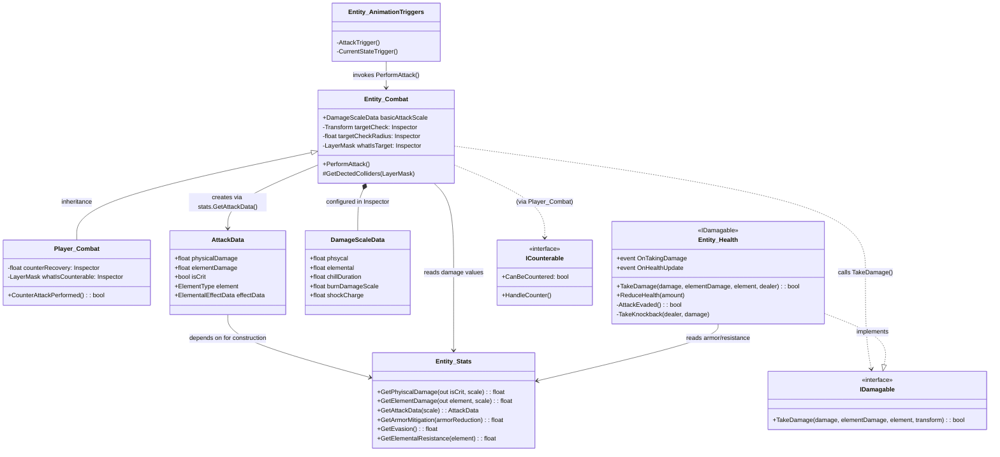
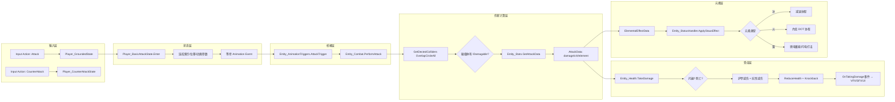

# 攻击系统实现分析

## 1. 系统定位：解决什么问题？

攻击系统负责处理完整的伤害链路：**输入检测 → 状态切换 → 动画播出 → 攻击判定 → 数值计算 → 抗性减免 → 扣血/击退 → VFX/SFX/元素效果**。

它是整个项目的核心玩法驱动系统。没有它，玩家与敌人的所有交互都停留在"碰撞体接触"层面。这个系统串联了状态机、属性系统、动画系统、物理检测和音视频表现五个子系统。

**初学者常见写法：** 直接在 `Update()` 里用 `Input.GetKeyDown` + `OverlapCircleAll` + `GetComponent<Health>().TakeDamage(10)`。问题在于所有逻辑耦合在一起，攻击速度不可配，伤害数值硬编码，无法扩展元素/暴击/连招。

---

## 2. 设计思路：为什么这样设计？

### 架构选型分析

| 可选方案 | 本项目选择 | 理由 |
|---------|-----------|------|
| 直接在 MonoBehaviour 的 Update 中处理 | 放入 FSM 状态类 | 攻击有明确的进入→持续→退出生命周期，和状态机天然匹配 |
| 代码计时器控制伤害判定时机 | Animation Event 驱动 | `anim.speed` 可调速，硬编码时间会与动画脱节 |
| 攻击数据直接写死在 Combat 方法里 | AttackData 数据类 + DamageScaleData 配置 | 分离数据与逻辑，不同攻击（普攻/技能）可复用同一套 Combat 流程 |
| 用 Tag 判断攻击目标 | Interface（IDamagable/ICounterable） | 接口可附带行为约定，比 Tag 字符串更类型安全 |

### 数据分层策略

```
DamageScaleData（可序列化配置数据，Inspector中赋值）
        ↓ 传入
AttackData（运行时数据，从 Stats 读取当前值 × 缩放系数，用完即弃）
        ↓ 消费
Entity_Combat.PerformAttack（逻辑层，遍历目标、调用接口、触发VFX/SFX）
        ↓ 调用
Entity_Health.TakeDamage（受击层，计算减伤、扣血、击退）
```

每一层职责单一，可独立修改。例如调整伤害公式只需要改 `Entity_Stats.GetPhyiscalDamage()`，不影响 Combat 的遍历逻辑和 Health 的受击处理。

---

## 3. 核心类与职责

| 类名 | 类型 | 核心职责 | 关键字段/方法 | 引用来源 |
|------|------|---------|-------------|---------|
| `Player_GroundedState` | 状态类 | 检测攻击输入，发起普攻/反击/远程攻击 | `input.Player.Attack.WasPressedThisFrame()` | 构造函数传入 Player |
| `Player_BasicAttackState` | 状态类 | 管理连招索引、位移、排队 | `comboIndex`, `comboAttackQueued`, `attackVelocity[]` | 构造函数传入 Player |
| `Player_CounterAttackState` | 状态类 | 执行反击，检测可反击目标 | `combat.CounterAttackPerformed()` | 构造函数 GetComponent |
| `Entity_Combat` | MonoBehaviour | 攻击判定中枢，检测目标 + 调度伤害 | `PerformAttack()`, `basicAttackScale` | Awake 中 GetComponent |
| `Player_Combat` | MonoBehaviour | 继承 Entity_Combat，增加反击检测 | `CounterAttackPerformed()`, `whatIsCounterable` | Inspector 拖拽 LayerMask |
| `AttackData` | 纯 C# 数据类 | 运行时伤害容器 | `physicalDamage`, `elementDamage`, `isCrit` | 由 `Entity_Stats.GetAttackData()` 创建 |
| `DamageScaleData` | Serializable 类 | 伤害缩放系数配置 | `phsycal`, `elemental`, `chillDuration` | Inspector 挂在 Entity_Combat 上 |
| `Entity_Stats` | MonoBehaviour | 提供所有伤害/防御数值 | `GetPhyiscalDamage()`, `GetElementDamage()`, `GetArmorMitigation()` | Awake 中 GetComponent |
| `Entity_Health` | MonoBehaviour | 承受伤害，扣血死亡，击退 | `TakeDamage()`, `ReduceHealth()`, `OnTakingDamage` event | Awake 中 GetComponent |
| `Entity_AnimationTriggers` | MonoBehaviour | 动画事件到代码的桥接 | `AttackTrigger()`, `CurrentStateTrigger()` | 挂在 Player 子物体上，GetComponentInParent 引用 |
| `Enemy_BattleState` | 状态类 | 敌人战斗决策：追击/撤退/攻击判断 | `WithinAttackRange()`, `CanAttack()`, `attackCooldown` | 构造函数传入 Enemy |
| `IDamagable` | Interface | 标记可受伤对象 | `TakeDamage()` | Player/Enemy 的 Health 实现 |
| `ICounterable` | Interface | 标记可反击对象 | `CanBeCountered`, `HandleCounter()` | Enemy_Skeleton 实现 |

---

## 4. 类图 / 流程图





---

## 5. 运行流程

### 玩家攻击完整时序

```
Time    Player.Update()
 │        └─ stateMachine.UpdateActiveState()
 │            └─ Player_GroundedState.Update()
 │                └─ input.Player.Attack.WasPressedThisFrame() → true
 │                    └─ stateMachine.ChangeState(player.basicAttackState)
 │
 │    Player_BasicAttackState.Enter()
 │        ├─ ResetComboIndexIfNeeded()     → comboIndex = 1（未超时）或递增
 │        ├─ SyncAttackSpeed()             → anim.SetFloat("attackSpeedMultiplier", ...)
 │        ├─ anim.SetInteger("basicAttackIndex", comboIndex)
 │        └─ ApplyAttackVelocity()         → SetVelocity(attackVelocity[0])
 │
 │    动画播放中...
 │    Player_BasicAttackState.Update()
 │        ├─ HandleAttackVelocity()        → 0.1s 后位移归零
 │        └─ 等待 input.Player.Attack → comboAttackQueued = true（排队）
 │
 │    Animation Event: AttackTrigger()  ← 第4-6帧（刀挥到判定范围）
 │        └─ Entity_Combat.PerformAttack()
 │            ├─ OverlapCircleAll(whatIsTarget)
 │            ├─ stats.GetAttackData(basicAttackScale)
 │            │   ├─ GetPhyiscalDamage → baseDamage + crit check
 │            │   └─ GetElementDamage → 最高元素 + 次级50% + intel
 │            ├─ damagable.TakeDamage(...)
 │            │   └─ Entity_Health.TakeDamage
 │            │       ├─ AttackEvaded? → return false
 │            │       ├─ GetArmorMitigation(armorReduction)
 │            │       ├─ GetElementalResistance(element)
 │            │       ├─ ReduceHealth(phys + elem)
 │            │       └─ TakeKnockback(轻击/重击)
 │            ├─ statusHandler.ApplyStausEffect(fire/ice/lightning)
 │            ├─ vfx.CreateOnHitVFX(crit, element)
 │            └─ sfx.PlayAttackHit/Miss()
 │
 │    Animation Event: CurrentStateTrigger()  ← 动画最后一帧
 │        └─ triggerCalled = true
 │
 │    Player_BasicAttackState.HandleStateExit()
 │        ├─ comboAttackQueued? → 延迟一帧 → ChangeState(basicAttackState)
 │        └─ 否 → ChangeState(idleState)
 │
 ▼    Player_BasicAttackState.Exit()
            └─ comboIndex++, lastTimeAttacked = Time.time
```

### 敌人攻击决策流程

```
Enemy_BattleState.Update()
   ├─ PlayerDetected()? → 更新目标 + 刷新战斗计时
   ├─ BattleTimeIsOver? → 回到 idle（脱离战斗）
   ├─ WithinAttackRange && CanAttack? → ChangeState(attackState)
   └─ 否 → 追击玩家 SetVelocity(x, y)

Enemy_AttackState.Enter()
   └─ SyncAttackSpeed()

[动画播放 → Animation Event: AttackTrigger → Entity_Combat.PerformAttack 同上]
[动画最后一帧 → CurrentStateTrigger → triggerCalled]
Enemy_AttackState.Update()
   └─ triggerCalled → ChangeState(battleState)
```

---

## 6. 关键细节拆解

### Animator 参数

| 参数名 | 类型 | 用途 | 设置位置 |
|--------|------|------|---------|
| `basicAttack` | Bool | 控制基础攻击动画播放/停止 | EntityState.Enter/Exit 自动设置 |
| `basicAttackIndex` | Integer | 选择连招第几段动画（1-3） | Player_BasicAttackState.Enter |
| `attackSpeedMultiplier` | Float | 控制动画播放速度，关联攻击速度属性 | EntityState.SyncAttackSpeed() |
| `yVelocity` | Float | 垂直速度参数，用于 Blend Tree 过渡 | PlayerState.UpdateAnimationParameters |
| `counterAttackPerformed` | Bool | 反击是否命中，切换不同动画 | Player_CounterAttackState.Enter |
| `jumpAttackTrigger` | Trigger | 空中攻击触地时触发的落地动画 | Player_JumpAttackState.Update |

### Animation Event 设置

**挂在 Player 子物体上的 Entity_AnimationTriggers 组件：**

| 事件方法 | 触发帧 | 所在动画 Clip | 作用 |
|---------|-------|-------------|------|
| `AttackTrigger()` | 第4-6帧 | `basicAttack1/2/3` | 执行攻击判定 OverlapCircle |
| `CurrentStateTrigger()` | 最后一帧 | `basicAttack1/2/3` | 设置 `triggerCalled = true` 通知状态机退出 |

**早/晚放的后果：**
- `AttackTrigger` 放早了：刀还没碰到人就看到伤害数字和受击特效
- `AttackTrigger` 放晚了：刀挥过身体后才出伤害，打击感像"砍空气"
- `CurrentStateTrigger` 放早了：连招还没播完就强制退出
- `CurrentStateTrigger` 放晚了：连招排队输入已经触发但切不过去，手感粘滞

### Collider / 物理检测

攻击判定使用 **`Physics2D.OverlapCircleAll`**，参数配置：

| 参数 | 配置位置 | 说明 |
|------|---------|------|
| `targetCheck` (Transform) | Entity_Combat Inspector | 判定圆心，通常是武器尖端的一个空物体 |
| `targetCheckRadius` (float) | Entity_Combat Inspector | 圆圈半径，约 1-1.5 |
| `whatIsTarget` (LayerMask) | Entity_Combat Inspector | 玩家设置为 "Enemy" 层，敌人设置为 "Player" 层 |

选择 OverlapCircle 而非 Raycast：
- OverlapCircle 是**范围检测**，对高速移动的小目标容错率高
- Raycast 是线检测，目标一帧内移出射线范围就检测不到
- trade-off：OverlapCircle 比 Raycast 性能稍差（检测范围更大）

### Input 绑定

使用 Unity **New Input System**，`PlayerInputSet` 是自动生成的 C# 类：

| 输入操作 | 绑定按键 | 检测方式 | 使用位置 |
|---------|---------|---------|---------|
| Attack | 鼠标左键 | `WasPressedThisFrame()` | Player_GroundedState → basicAttackState |
| CounterAttack | 鼠标右键 | `WasPressedThisFrame()` | Player_GroundedState → counterAttackState |
| RangeAttack | F 键 | `WasPerformedThisFrame()` | Player_GroundedState → swordThrowState |

### 事件订阅

| 事件 | 订阅者 | 订阅位置 | 取消订阅位置 | 泄漏风险 |
|------|--------|---------|-------------|---------|
| `Entity_Health.OnTakingDamage` | UI 刷新 | SetupHealth | OnDestroy 未显式取消（通过 `-=`） | 低—Health 与 Entity 同生命周期 |
| `Player.OnPlayerDeath` | Enemy | Enemy.OnEnable | Enemy.OnDisable | 无—对称订阅取消 |
| `OnHealthUpdate` | UI HealthBar | SetupHealth | 未取消 | 有泄漏风险，MonoBehaviour 销毁后回调可能报空 |

### 反击窗口

```csharp
// Player_CounterAttackState.cs
public override void Enter() {
    stateTimer = combat.GetCounterRecoveryDuration();  // 0.1s
    counteredSomebody = combat.CounterAttackPerformed();
}

public override void Update() {
    if (stateTimer < 0 && !counteredSomebody)
        stateMachine.ChangeState(player.idleState);  // 没打到人，提前退出
}
```

`counterRecovery = 0.1s` 是反击判定窗口。如果 Enter 时没有检测到可反击目标，0.1 秒后自动退出回到 idle。反击检测使用独立的 `whatIsCounterable` LayerMask，与普通攻击的 `whatIsTarget` 分开。

### 连招排队机制

```csharp
// Player_BasicAttackState.cs
private void QueueNextAttack() {
    if (comboIndex < comboLimit)
        comboAttackQueued = true;
}

private void HandleStateExit() {
    if (comboAttackQueued) {
        anim.SetBool(animBoolName, false);   // 关键：手动取消当前动画
        player.EnterAttaclStateWithDelay();   // 延迟一帧再进入
    } else
        stateMachine.ChangeState(player.idleState);
}
```

`comboLimit = 3`，`comboResetTime = 1s`。超过 1 秒没攻击或者超出 3 段就重置到第一段。

---

## 7. 与 Unity 自带系统的关系

| 方面 | 本项目方案 | Unity 自带方案 | 为什么选这个 |
|------|-----------|---------------|------------|
| 行为管理 | 自定义 FSM（StateMachine + EntityState 继承链） | Animator Controller + StateMachineBehaviour | 代码状态机可以持有数据、调用其他系统、做复杂逻辑判断；Animator 只负责动画播放，不承载游戏逻辑 |
| 伤害判定 | Animation Event → Entity_Combat | Animator 的 Timeline 或代码计时器 | Animation Event 不受 anim.speed 影响，帧精确 |
| 数值管理 | 自定义 Stat + Modifier 体系 | ScriptableObject + 简单 float | Modifier 支持按 source 精确追踪，装备/Buff/技能可以独立增删 |
| 目标检测 | Physics2D.OverlapCircleAll | OnTriggerEnter + Collider | 项目使用范围判定而非物理碰撞触发，OnTriggerEnter 无法控制"哪一帧进行判定" |
| 系统间通信 | Interface (IDamagable/ICounterable) + event + GetComponent | SendMessage / UnityEvent | Interface 编译期类型安全，性能更好；event 支持多播 |

---

## 8. 正面例子 vs 反面例子

### 反面：初学者 if-else + bool 堆积写法

```csharp
public class PlayerAttack : MonoBehaviour {
    public bool canAttack = true;
    public int comboCount = 0;

    void Update() {
        if (Input.GetKeyDown(KeyCode.J) && canAttack) {
            canAttack = false;
            comboCount = (comboCount + 1) % 3;
            anim.SetTrigger("attack" + comboCount);

            Collider2D[] hits = Physics2D.OverlapCircleAll(attackPoint.position, 1f);
            foreach (var hit in hits) {
                if (hit.CompareTag("Enemy")) {
                    float dmg = comboCount == 2 ? 30 : 15; // 连招伤害硬编码
                    hit.GetComponent<Health>().TakeDamage(dmg);
                }
            }
            Invoke(nameof(ResetAttack), 0.5f);  // 攻击间隔硬编码
        }
    }

    void ResetAttack() {
        canAttack = true;
        if (Time.time - lastAttackTime > 1.5f) comboCount = 0;
    }
}
```

问题：
- 伤害公式写在攻击判定的循环里，无法复用
- 攻击速度通过 `Invoke` 写死，不能通过装备/技能改变
- 暴击/元素/护甲全无，扩展需要改整个方法
- 动画速度变了但判定时机不变，打击感错位
- 连招耦合在 Update 的 if-else 中，新增一种攻击需要加更多 bool

### 正面：项目当前设计

```csharp
// 输入检测 — 在状态机中独立处理
// Player_GroundedState.cs
if (input.Player.Attack.WasPressedThisFrame())
    stateMachine.ChangeState(player.basicAttackState);

// 攻击逻辑 — 独立状态类管理连招和生命周期
// Player_BasicAttackState.cs: 管理 comboIndex + comboAttackQueued + triggerCalled

// 伤害判定 — 通过 Animation Event 触发，与动画同步
// Entity_AnimationTriggers → entityCombat.PerformAttack()

// 数值计算 — 统一在 Entity_Stats 中，暴击/元素/护甲全部可配置
// Entity_Stats.GetPhyiscalDamage() / GetElementDamage()

// 受击处理 — Entity_Health 统一管理减伤/闪避/击退/死亡
// IDamagable.TakeDamage() → 护甲减伤 + 抗性减伤 + 元素效果
```

优点：
- 新增攻击类型只需要新建一个状态类继承 PlayerState
- 攻击速度由 `Stat.attackSpeed` 控制，装备/Buff 可精确修改
- 伤害公式集中在 `Entity_Stats`，全角色统一
- 动画事件确保帧精确判定

---

## 9. 易混淆点 FAQ

**Q1: `Entity_Combat` 为什么挂在子物体上而不是直接挂在 Player 上？**

因为 `Entity_AnimationTriggers` 也挂在同一个子物体上，而 Animation Event 只能调用挂载在同一个 GameObject 上的 public 方法。所以两者放在同一个子物体上，`AttackTrigger()` 可以直接访问同对象的 `entityCombat.PerformAttack()`。

**Q2: `basicAttackScale`（DamageScaleData）为什么用 Serializable 而不是 ScriptableObject？**

分析代码发现 `DamageScaleData` 被声明为 `[Serializable]` 类直接嵌入 Entity_Combat 中。这意味着不同角色（Player vs Skeleton vs Reaper）的缩放系数在 Inspector 中各配各的，互不影响。如果做成 SO，反而需要为每种敌人创建独立的 SO 资源文件——当前方案更轻量。

**Q3: 为什么闪避判定放在 `Entity_Health.TakeDamage` 而不是 `Entity_Combat.PerformAttack`？**

因为闪避是被攻击方的行为，应该由被攻击方控制逻辑。如果放在 PerformAttack 中，每个攻击者都要重复实现闪避逻辑，而且获取被攻击方的 evasion 值需要额外引用。放在 Health 侧，职责更清晰，也方便以后加"闪避后触发加速 Buff"这类效果。

**Q4: `canChangeState` 会影响攻击吗？**

`StateMachine.canChangeState` 是一个全局锁，默认为 true。在 Player 中翻遍代码没有发现主动设置为 false 的地方。但在 Enemy 中某些状态（如死亡动画）可能需要锁。攻击过程中 `canChangeState` 始终为 true，所以攻击可以被冲刺、技能等操作打断。

**Q5: 元素效果中的"感电蓄能"具体怎么工作的？**

闪电效果特殊之处在于它可以**叠加**：`CanBeApplied(Lightning)` 返回 `true` 的条件是 `currentEffect == None || currentEffect == Lightning`。每次攻击叠加 `shockCharge`（默认 0.4），累积到 `maximumCharge = 1.0` 时触发闪电打击，然后充能归零。其他元素（冰/火）在效果持续期间无法再次应用。

**Q6: 为什么敌人攻击也使用完全相同的 `Entity_Combat.PerformAttack()`？**

设计意图是统一伤害判定逻辑。Player 打敌人和敌人打 Player 走的是同一套流程：OverlapCircle → AttackData 组装 → IDamagable.TakeDamage → 减伤/扣血/击退。区别仅在于 `whatIsTarget` LayerMask 不同（Player 检测 Enemy，敌人检测 Player）。

**Q7: 远程攻击（剑投掷）怎么走攻击系统？**

远程技能会切换到 `Player_SwordThrowState`，不走 `Entity_Combat.PerformAttack()` 的范围检测。而是由投掷出的 `SkillObject_Sword` 子物体通过自己的碰撞器触发伤害。但最终仍然调用 `IDamagable.TakeDamage`，所以受击端（护甲/抗性/闪避）逻辑完全复用。

---

## 10. 如何迁移到自己的项目

### 可直接复用的代码

| 文件/类 | 复用方式 | 依赖 |
|---------|---------|------|
| `IDamagable.cs` / `ICounterable.cs` | 直接复制 | 无依赖 |
| `AttackData.cs` / `DamageScaleData.cs` / `ElementalEffectData.cs` | 直接复制 | 依赖 `Entity_Stats` 和 `ElementType` 枚举 |
| `Entity_Health.cs` | 复制后改命名空间 | 依赖 Entity_Stats、Entity（击退用） |
| `Entity_Combat.cs` | 复制后改命名空间 | 依赖 Entity_Stats、IDamagable、VFX/SFX |

### 需要改造的部分

- **FSM 绑定：** `Player_BasicAttackState` 强依赖本项目的三层状态机继承体系。如果迁移到其他项目没有这套 FSM，需要提取连招逻辑的核心部分重写状态管理
- **Stats 系统：** `AttackData` 的构造函数调用了 `Entity_Stats` 的具体方法。如果目标项目有自己的属性系统，需要修改数据读取部分
- **VFX/SFX：** `Entity_Combat.PerformAttack` 中调用了 `vfx.CreateOnHitVFX()` 和 `sfx.PlayAttackHit()`，迁移时需要替换成自己的 VFX/SFX 管理器

### Unity 编辑器配置清单

1. 创建 `targetCheck` 空物体放在武器尖端位置
2. 在 Entity_Combat 上配置 `whatIsTarget` LayerMask
3. 设置 `targetCheckRadius`（根据武器攻击范围）
4. 在 Animator Controller 中添加 `basicAttack`（Bool）、`basicAttackIndex`（Int）、`attackSpeedMultiplier`（Float）参数
5. 在攻击动画 Clip 对应帧添加 Animation Event，挂载 Entity_AnimationTriggers 组件

### 迁移后最容易出的 Bug

- **Animation Event 方法名不匹配：** Unity 编辑器不会编译检查方法名，拼错只会在控制台打印警告
- **targetCheck 为 null：** `OverlapCircleAll` 以 Vector3.zero 为圆心，攻击永远打不中人
- **LayerMask 没设置：** `whatIsTarget` 默认是 "Nothing"，OverlapCircle 不检测任何碰撞体
- **whatIsCounterable 没设置：** 反击永远检测不到可反击目标

---

## 11. 总结

**系统本质：** 一个 Animation Event 驱动的分层伤害管线。

**最重要类：** `Entity_Combat`（调度中心）+ `Entity_Stats`（数据提供方）+ `Entity_Health`（数据消费方）。

**核心流程：** 状态机进入攻击动画 → 动画播放到指定帧 → Animation Event 触发 `Entity_Combat.PerformAttack` → OverlapCircle 检测目标 → 从 `Entity_Stats` 组装 `AttackData` → 调用目标 `IDamagable.TakeDamage` → 护甲/抗性减伤 → 扣血 + 击退 + 元素效果 + VFX/SFX。

**最该学到的东西：** 用 Interface（IDamagable/ICounterable）做系统边界解耦，用 Animation Event 保证帧精确判定，用分层数据类（DamageScaleData → AttackData）分离配置与运行时数据。这三个手段让攻击系统可以独立扩展而不影响其他子系统。
