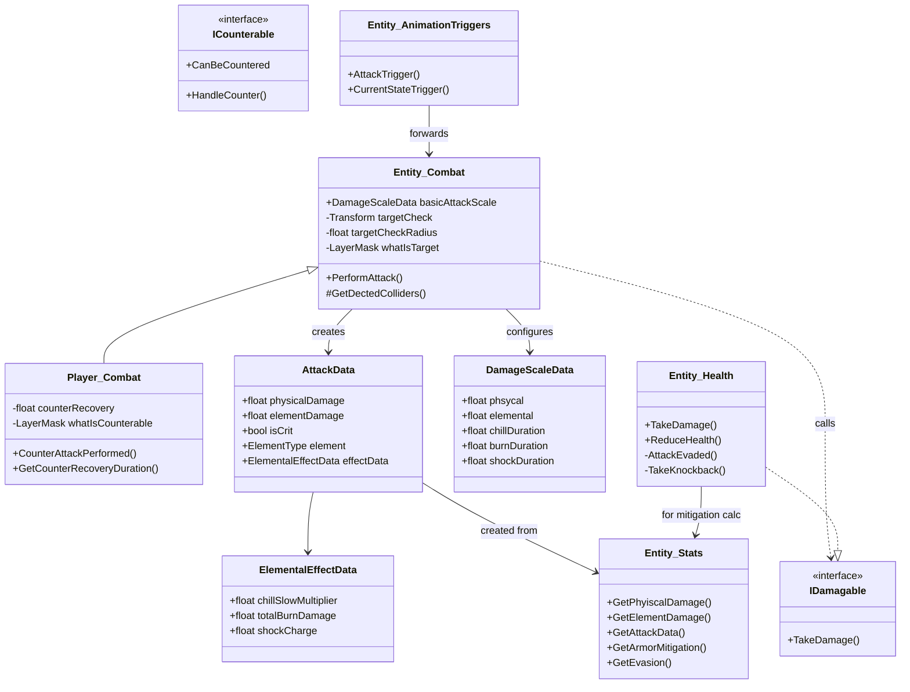

# 攻击系统深度分析 — Udemy 2D RPG 项目

## 1. 系统定位：解决什么问题？

攻击系统负责处理游戏中"造成伤害"的完整链路：**输入检测 → 触发攻击动画 → 攻击判定 → 数值计算 → 伤害应用 → 受击反馈（音效/VFX/击退/元素效果）**。

它不像状态机那样是基础骨架，而是**将状态机、数值系统、动画系统、物理检测、音视频表现全部串联起来**的核心玩法系统。没有这个系统，玩家就只是个能跑能跳的模型。

**初学者通常会这么写：**

```csharp
// 在 Update 里写 if (Input.GetKeyDown(KeyCode.J)) {
//     Collider2D[] hits = Physics2D.OverlapCircleAll(...)
//     foreach (var hit in hits) {
//         hit.GetComponent<Health>().TakeDamage(10);
//     }
// }
```

问题在于：攻击速度无法调节、伤害值硬编码、没有元素系统、没有击退/VFX/音效、连招要靠临时 bool 变量堆砌。**这个项目通过 10+ 个类和文件的分工协作，把"攻击"这件事拆分成了可扩展的管线**。

---

## 2. 设计思路：为什么这样设计？

### 2.1 为什么攻击逻辑放进状态机而不是直接写在 Update 里？

因为攻击需要**完整的动画驱动**。攻击不是瞬间完成的操作——它有起手帧、判定帧、收招帧，动画速度还会被 attackSpeed 属性影响。状态机提供 Enter/Update/Exit 三个生命周期钩子，天然适合：

- Enter：确定连招索引、同步攻击速度、应用初始位移
- Update：检测下一段连招输入、维持攻击位移、等待动画事件触发切换到退出
- Exit：递增连招索引、记录最后攻击时间

### 2.2 为什么伤害判定用 Animation Event 而不是代码计时？

```csharp
// Entity_AnimationTriggers - 动画事件桥接
private void AttackTrigger() {
    entityCombat.PerformAttack();  // 当动画播放到"刀挥到敌人"的那一帧触发
}
```

如果写在代码里用 `timer += Time.deltaTime` 来判断"0.3 秒后造成伤害"，那么：
- 攻击速度改变时（`anim.speed` 变了），代码计时和动画不同步
- 不同武器不同动画长度，硬编码时间不通用
- 顿帧/减速效果会打乱时序

**Animation Event 绑定在具体动画 Clip 的帧上，动画速度变了，触发时机也随之变化，天然同步。**

### 2.3 为什么攻击波形图那么复杂？（AttackData/DamageScaleData/Entity_Combat）

分层设计的目的是**可配置性**：

```
DamageScaleData (SO/可序列化数据, 配置缩放系数)
       ↓
AttackData (运行时组装, 从 Stats 读取数值 × 缩放系数)
       ↓
Entity_Combat.PerformAttack() (逻辑层, 遍历目标、调用 IDamagable)
       ↓
Entity_Health.TakeDamage() (表现层, 减血/击退/VFX)
```

每一层只做自己的事，改动一个层不影响其他层。例如想加一个"破甲"效果，只需要在 AttackData 加字段 → PerformAttack 传入 → TakeDamage 使用，不需要改状态机代码。

---

## 3. 核心类与职责

| 类名 | 类型 | 核心职责 | 关键字段/方法 | 与其他类的关系 |
|------|------|---------|-------------|--------------|
| `Player_GroundedState` | FSM State | 检测攻击输入，发起普通攻击/反击/远程攻击 | `input.Player.Attack.WasPressedThisFrame()` | → 切换到 `player.basicAttackState` |
| `Player_BasicAttackState` | FSM State | 管理 3 段连招的索引、位移、排队、超时重置 | `comboIndex`, `comboAttackQueued`, `attackVelocity[]` | → 持有 Player 引用读取 attackVelocity |
| `Player_CounterAttackState` | FSM State | 执行反击，检测可反击目标 | `combat.CounterAttackPerformed()` | → 使用 `Player_Combat` |
| `Player_JumpAttackState` | FSM State | 空中攻击，触地时触发落地特效 | `jumpAttackTrigger` | → 动画事件驱动触发 |
| `Entity_Combat` | MonoBehaviour | 核心攻击判定，遍历目标，调用 IDamagable | `PerformAttack()`, `basicAttackScale`, `targetCheck` | → 持有 `Entity_Stats`, → 调用 `IDamagable.TakeDamage()` |
| `Player_Combat` | 继承 Entity_Combat | 添加反击功能 | `CounterAttackPerformed()`, `whatIsCounterable` | → 检测 `ICounterable` |
| `AttackData` | 纯 C# 数据类 | 运行时伤害数据容器 | `physicalDamage`, `elementDamage`, `isCrit`, `element` | → 由 `Entity_Stats.GetAttackData()` 创建 |
| `DamageScaleData` | Serializable 数据 | 配置伤害缩放系数和元素效果参数 | `phsycal`, `elemental`, `chillDuration`, `burnDamageScale` | → 在 Inspector 中配置在 `Entity_Combat.basicAttackScale` |
| `ElementalEffectData` | 纯 C# 数据类 | 运行时元素效果数据 | `chillSlowMultiplier`, `totalBurnDamage`, `shockCharge` | → 由 `Entity_Stats` 构造 |
| `Entity_Stats` | MonoBehaviour | 角色属性数值 | `GetPhyiscalDamage()`, `GetElementDamage()`, `GetAttackData()` | → 持有 `Stat_OffenseGroup` 等 |
| `Entity_Health` | MonoBehaviour | 承受伤害、减血、死亡 | `TakeDamage()`, `ReduceHealth()`, `AttackEvaded()` | → 实现 `IDamagable` |
| `Entity_AnimationTriggers` | MonoBehaviour | 动画事件桥接，转发给 Combat | `AttackTrigger()` → `entityCombat.PerformAttack()` | → 挂在子物体上，通过 `GetComponentInParent` 引用 |
| `Enemy_AttackState` | FSM State | 敌人攻击状态骨架 | 触发 `triggerCalled` 后回到 battleState | → 等待动画事件 |
| `Enemy_BattleState` | FSM State | 敌人战斗决策——追击/撤退/攻击 | `WithinAttackRange() && CanAttack()` | → 决定切换到 `attackState` |
| `ICounterable` | Interface | 可被反击标记 | `CanBeCountered`, `HandleCounter()` | → `Enemy_Skeleton` 实现 |
| `IDamagable` | Interface | 可受伤标记 | `TakeDamage()` | → `Entity_Health` 实现 |

---

## 4. 类图 / 流程图



```mermaid
flowchart TD
    A[Player 按下攻击键] --> B[Player_GroundedState.Update]
    B --> C[stateMachine.ChangeState basicAttackState]
    C --> D[Enter: 设置comboIndex\n应用attackVelocity\n同步attackSpeedMultiplier]
    D --> E[Update: 检测下一段输入]
    E --> F{WasPressedThisFrame?}
    F -- 是且comboIndex<3 --> G[comboAttackQueued = true]
    F -- 否 --> H[等待 triggerCalled]
    
    H --> I{Animation Event\n触发?}
    I -- 否 --> E
    
    I -- CurrentStateTrigger() --> J[triggerCalled = true]
    J --> K{comboAttackQueued?}
    K -- 是 --> L[EnterAttackStateWithDelay\nWaitForEndOfFrame]
    L --> C
    K -- 否 --> M[ChangeState idle]
    
    subgraph 伤害判定管线
        N[Animation Event:\nAttackTrigger()] 
        N --> O[Entity_Combat.PerformAttack]
        O --> P[OverlapCircleAll\n检测目标]
        P --> Q{目标是\nIDamagable?}
        Q -- 是 --> R[Entity_Stats.GetAttackData\n创建AttackData]
        R --> S[damagable.TakeDamage]
        S --> T[Entity_Health\n计算护甲/抗性减伤]
        T --> U[ReduceHealth + Knockback]
        U --> V[VFX + SFX]
    end
```

---

## 5. 运行流程

### 5.1 玩家普通攻击完整链路

**帧1 — 输入检测：**

```
Player.Update()                          // Entity.cs:54-59
  └─ stateMachine.UpdateActiveState()     // 当前状态是 GroundedState
      └─ Player_GroundedState.Update()   // Player_GroundedState.cs:9-33
          └─ input.Player.Attack.WasPressedThisFrame()  // :22-25
              └─ stateMachine.ChangeState(player.basicAttackState)
```

**帧1 — 进入攻击状态：**

```
Player_BasicAttackState.Enter()           // Player_BasicAttackState.cs:21-32
  ├─ ResetComboIndexIfNeeded()            // 超时(1s) 则 comboIndex = 1
  ├─ SyncAttackSpeed()                    // anim.SetFloat("attackSpeedMultiplier", attackSpeed)
  ├─ anim.SetInteger("basicAttackIndex", comboIndex)  // 选择第几段动画
  └─ ApplyAttackVelocity()               // SetVelocity(attackVelocity[comboIndex-1])
```

`attackVelocity` 是在 Player Inspector 中配置的 `Vector2[]` 数组，例如 `[{2,0}, {3,0}, {4,0}]`，每段连招的位移不同。

**动画播放期间 — 位移衰减：**

```
Player_BasicAttackState.Update()          // :36-57
  ├─ HandleAttackVelocity()               // 计时器归零后 SetVelocity(0, y)
  ├─ 检测下一段输入                       // 按了攻击键则 comboAttackQueued = true
  └─ 等待 triggerCalled
```

**动画特定帧 — Animation Event 触发：**

Animation Event 配置在 `Assets/Animations/Player/basicAttack1/2/3` 的对应帧上：
- **`AttackTrigger()`** — 在第 4-6 帧（刀挥到判定范围时）触发 → 执行伤害判定
- **`CurrentStateTrigger()`** — 在动画最后一帧触发 → 通知状态机退出

```
AttackTrigger()                           // Entity_AnimationTriggers.cs:21-26
  └─ entityCombat.PerformAttack()         // Entity_Combat.cs:27-125
      ├─ GetDectedColliders(whatIsTarget) // OverlapCircleAll
      ├─ stats.GetAttackData(basicAttackScale)
      │   ├─ GetPhyiscalDamage() → 基础伤害 + 暴击判定
      │   └─ GetElementDamage()  → 取最高元素伤害 + 50% 次级元素 + 智力加成
      ├─ damagable.TakeDamage()           // 遍历每个目标
      │   └─ Entity_Health.TakeDamage()   // :66-93
      │       ├─ AttackEvaded()           // 闪避判定
      │       ├─ GetArmorMitigation()     // 护甲减伤
      │       ├─ GetElementalResistance() // 元素抗性
      │       ├─ ReduceHealth()           // 实际扣血
      │       └─ TakeKnockback()          // 击退
      ├─ statusHandler.ApplyStausEffect() // 元素效果 (冰冻/燃烧/感电)
      ├─ vfx.CreateOnHitVFX()             // 受击特效 (暴击/元素)
      └─ sfx.PlayAttackHit/Miss()         // 音效
```

**状态退出：**

```
CurrentStateTrigger()                     // 动画最后一帧
  └─ entity.CurrentStateAnimationTrigger()
      └─ stateMachine.currentSate.AnimationTrigger()  // triggerCalled = true

Player_BasicAttackState.HandleStateExit() // :59-68
  ├─ comboAttackQueued? → EnterAttackStateWithDelay()  // 连招接续
  │   └─ StartCoroutine(WaitForEndOfFrame → ChangeState(basicAttackState))
  └─ 否 → ChangeState(idleState)

Player_BasicAttackState.Exit()            // :77-84
  ├─ comboIndex++                         // 下次进入时索引递增
  └─ lastTimeAttacked = Time.time         // 记录时间用于超时重置
```

### 5.2 敌人攻击流程

```
Enemy_BattleState.Update()                // Enemy_BattleState.cs:42-67
  ├─ WithinAttackRange()                  // 距离 < attackDistance
  ├─ CanAttack()                          // cooldown 已过
  └─ stateMachine.ChangeState(enemy.attackState)

Enemy_AttackState.Enter()                 // Enemy_AttackState.cs:9-13
  └─ SyncAttackSpeed()                    // 同样受 attackSpeed 属性影响

[动画播放 → AttackTrigger() → 同理走 Entity_Combat.PerformAttack]
[动画最后一帧 → CurrentStateTrigger()]

Enemy_AttackState.Update()                // :16-21
  └─ triggerCalled → ChangeState(enemy.battleState)
```

### 5.3 反击流程

```
Player_CounterAttackState.Enter()         // Player_CounterAttackState.cs:13-20
  ├─ stateTimer = counterRecovery         // 0.1s 反击窗口
  └─ combat.CounterAttackPerformed()      // 检测 whatIsCounterable 层
      └─ ICounterable.HandleCounter()     // → Enemy_Skeleton 进入眩晕状态

[如果反击窗口内没有目标 → stateTimer < 0 → 回到 idle]
[如果动画事件触发 → triggerCalled → 回到 idle]
```

---

## 6. 关键实现细节

### 6.1 连招系统（Player_BasicAttackState）

**连招索引管理：**

```csharp
// Player_BasicAttackState.cs:98-107
private void ResetComboIndexIfNeeded() {
    if (Time.time > player.comboResetTime + lastTimeAttacked)
        comboIndex = FirstComboIndex;       // 超时1秒 → 重置到第1段
    if (comboIndex > comboLimit)
        comboIndex = FirstComboIndex;       // 超出3段 → 重置
}
```

`comboResetTime` 在 Player Inspector 中配置（默认 1 秒），超过这个时间没有攻击就重置连招。

**连招排队机制：**

```csharp
// Player_BasicAttackState.cs:59-68
private void HandleStateExit() {
    if (comboAttackQueued) {
        anim.SetBool(animBoolName, false);  // 先取消当前动画
        player.EnterAttaclStateWithDelay();
    } else
        stateMachine.ChangeState(player.idleState);
}
```

注意 `anim.SetBool(animBoolName, false)` 在 `ChangeState` 之前手动调用。因为 `EnterAttaclStateWithDelay` 使用协程延迟一帧（`WaitForEndOfFrame`），如果不手动取消，这一帧内 animator 的 bool 参数还是 true，会导致闪现一下错误的动画。

**延迟一帧进入：**

```csharp
// Player.cs:160-174
private IEnumerator EnterAttackStateWithDelayCo() {
    yield return new WaitForEndOfFrame();   // 关键！等当前帧完全结束
    stateMachine.ChangeState(basicAttackState);
}
```

问为什么延迟一帧？因为如果在同一个帧内连续两次 `ChangeState(basicAttackState)`，第一次调用了 `Exit()`（++comboIndex），第二次`Enter()`（重置连招检测），但 `comboAttackQueued` 还没来得及被重置为 false。延迟一帧让状态机有时间完成当前状态的完整退出流程。

**连招位移参数：**

`player.attackVelocity` 是一个 `Vector2[]`，在 Player Inspector 中配置：

| 连招段 | 位移 (x, y) |
|--------|-------------|
| 第1段 | (2, 0) |
| 第2段 | (3, 0) |
| 第3段 | (4, 0) |

`attackVelocityDuration`（默认 0.1 秒）控制位移持续多长时间后停下来。

### 6.2 AttackData — 伤害数据组装

```csharp
// AttackData.cs:15-21
public AttackData(Entity_Stats entityStats, DamageScaleData scaleData) {
    physicalDamage = entityStats.GetPhyiscalDamage(out isCrit, scaleData.phsycal);
    elementDamage = entityStats.GetElementDamage(out element, scaleData.elemental);
    effectData = new ElementalEffectData(entityStats, scaleData);
}
```

**物理伤害计算：**

```csharp
// Entity_Stats.cs:111-123
public float GetPhyiscalDamage(out bool isCrit, float scaleFactor = 1f) {
    float baseDamage = GetBaseDamage();       // damage stat + strength
    float critChance = GetCritChance();       // critChance stat + agility*0.3
    float critPower = GetCritPower() / 100;   // critPower stat + strength*0.5
    isCrit = Random.Range(0, 100) < critChance;
    float finalDamage = isCrit ? baseDamage * critPower : baseDamage;
    return finalDamage * scaleFactor;
}
```

暴击率 = `critChance` + `agility × 0.3`；暴击伤害 = `baseDamage × (critPower/100 + strength × 0.5/100)`。

**元素伤害计算：**

```csharp
// Entity_Stats.cs:46-83
public float GetElementDamage(out ElementType element, float scaleFactor = 1f) {
    // 取 fire/ice/lightning 中的最高值作为主元素
    // 其他两种元素只贡献50%伤害
    // 追加 intelligence 属性加成
}
```

**护甲减伤公式（类 LOL 公式）：**

```csharp
// Entity_Stats.cs:130-143
float mitigation = effectiveArmor / (effectiveArmor + 100);  // 上限85%
```

护甲 = `armor stat + vitality`，再加上 `armorReduction`（来自攻击者的破甲属性）的削减。

### 6.3 Unity 编辑器配置

| 配置项 | 位置 | 关键设置 |
|--------|------|---------|
| `attackVelocity[]` | Player Inspector | 3 组 Vector2，每段连招的位移量 |
| `basicAttackScale` | Entity_Combat Inspector | DamageScaleData，配置伤害缩放倍数和元素效果参数 |
| `targetCheck` | Entity_Combat Inspector | Transform，OverlapCircleAll 的中心点（通常在武器尖端） |
| `targetCheckRadius` | Entity_Combat Inspector | 默认约 1-1.5，攻击判定范围 |
| `whatIsTarget` | Entity_Combat Inspector | LayerMask，设为 "Enemy"（玩家）或 "Player"（敌人） |
| `comboResetTime` | Player Inspector | 默认 1 秒，超过这个时间连招重置 |
| `Animator` 参数 | 基础攻击动画 Controller | `basicAttackIndex` (Integer)，`attackSpeedMultiplier` (Float)，`basicAttack` (Bool) |

**Animation Event 配置：**

| 事件 | 挂在哪个 Clip | 帧数 | 调用方法 |
|------|-------------|------|---------|
| 攻击判定 | `basicAttack1/2/3` | 第4-6帧 | `AttackTrigger()` |
| 状态退出 | `basicAttack1/2/3` | 最后一帧 | `CurrentStateTrigger()` |

注意 `AttackTrigger` 的帧数必须对齐武器实际挥到敌人的那帧。放早了：刀还没碰到人就有伤害反馈；放晚了：刀已经挥过去了才出伤害，打击感变"砍空气感"。

### 6.4 受伤方的处理

```csharp
// Entity_Health.cs:66-93
public virtual bool TakeDamage(float damage, float elementalDamage, ElementType element, Transform damageDealer) {
    if (isDead || canTakenDamage == false) return false;
    if (AttackEvaded()) return false;       // 闪避判定

    float armorReduction = attackStates.GetArmorReduction();
    float mitigation = entityStats.GetArmorMitigation(armorReduction);
    float resistance = entityStats.GetElementalResistance(element);

    float physicalDamageTaken = damage * (1 - mitigation);
    float elementalDamageTaken = elementalDamage * (1 - resistance);

    TakeKnockback(damageDealer, physicalDamageTaken);
    ReduceHealth(physicalDamageTaken + elementalDamageTaken);
    OnTakingDamage?.Invoke();               // 通知其他系统（如UI）
    return true;
}
```

**击退区分轻重：** 一次受伤超过最大生命值 30% 被视为重击，击退距离和击退时间都会翻倍。`heavyKnockbackPower = (7, 7)` vs 普通 `(1.5, 2.5)`。

### 6.5 元素效果系统

攻击附带元素伤害时，还会应用元素状态效果：

| 元素 | 效果 | 关键参数 | 实现方式 |
|------|------|---------|---------|
| 冰 (Ice) | 减速 | `chillSlowMultiplier = 0.2`（减速80%），持续3秒 | 协程修改 `moveSpeed` 和 `anim.speed` |
| 火 (Fire) | 灼烧 DOT | 每秒 2 跳，总伤害 = fireDamage × burnDamageScale | 协程每 0.5 秒一次伤害 |
| 雷 (Lightning) | 感电蓄能 | 每次叠加 `shockCharge`，满 1.0 触发闪电打击 | 可叠加！同层效果会继续加 charge |

注意 **闪电特殊**：`CanBeApplied(ElementType.Lightning)` 即使当前是 Lightning 效果也返回 `true`，意味着感电能叠加充能。别的元素必须在 `currentEffect == None` 才能应用。

---

## 7. 优化手段

- **无 GC 伤害数据：** `AttackData` 和 `ElementalEffectData` 是纯 C# 类，每次攻击 `new` 会产生 GC。如果要优化，可以用对象池重用 `AttackData`。但攻击频率不高（每秒最多 3-4 次），当前写法 GC 压力可忽略。
- **OverlapCircleAll 的数组分配：** `GetDectedColliders()` 每次调用 `Physics2D.OverlapCircleAll` 会分配数组。可以用 `OverlapCircleNonAlloc` + 预分配 Collider[] 来优化。

---

## 8. 与 Unity 自带系统的关系

| 本系统做法 | Unity 自带替代 | 为什么这么选 |
|-----------|--------------|------------|
| Animation Event 接伤害判定 | 用代码计时器 | 动画速度可变时保证同步 |
| 自定义 Stat 属性系统 | 简单 float 变量 | 支持 modifier 来源追踪（Buff/装备） |
| 状态机 + triggerCalled | Animator 的 Exit Time | 精确控制代码逻辑的切换时机 |
| ICounterable 接口 | 用 Tag 判断 | Tag 不够灵活，接口可携带行为 |

---

## 9. 正面例子 vs 反面例子

**反面例子（初学者写法）：**

```csharp
void Update() {
    if (Input.GetKeyDown(KeyCode.J) && canAttack) {
        canAttack = false;
        anim.SetTrigger("attack");
        // 直接在Update里面做伤害判定
        Collider2D[] hits = Physics2D.OverlapCircleAll(attackPoint.position, 1f);
        foreach (var hit in hits) {
            if (hit.CompareTag("Enemy")) {
                hit.GetComponent<Health>().TakeDamage(10);
            }
        }
        Invoke(nameof(ResetAttack), 0.5f);
    }
}
```

问题：伤害数值硬编码、攻击速度不可配、暴击/元素/护甲全无、伤害判定放在输入帧而不是动画指定帧、无法连招。

**正面例子（项目写法）：**

```csharp
// 输入检测在 GroundedState，攻击逻辑在 BasicAttackState
// 伤害判定在 Animation Event → Combat 管线
// 数值全部走 Stat 属性系统
// 连招用 comboIndex + comboAttackQueued + 延迟一帧
```

优点：
- 新增一种攻击类型只需要新状态类
- 攻击速度由 stat 控制，不需要改代码
- 伤害公式集中在一个地方调整
- 动画事件确保打击感精确

---

## 10. 易混淆点 FAQ

**Q1: 为什么 `comboAttackQueued` 需要延迟一帧而不是直接 ChangeState？**

如果当前帧直接 `ChangeState(basicAttackState)`，会立即调用当前状态的 `Exit()` 和新状态的 `Enter()`。但 `HandleStateExit` 是在 `triggerCalled` 的判断中调用的，这一帧的 `Update()` 还没执行完——新状态的 `Enter()` 中 `ResetComboIndexIfNeeded` 可能因为时序问题读到旧的 `comboIndex`。`WaitForEndOfFrame` 确保当前帧所有逻辑执行完毕后再切换。

**Q2: `triggerCalled` 是怎么被设为 true 的？**

Animation Event → `Entity_AnimationTriggers.CurrentStateTrigger()` → `Entity.CurrentStateAnimationTrigger()` → `stateMachine.currentSate.AnimationTrigger()` → `triggerCalled = true`。

**Q3: DamageScaleData 和 AttackData 有什么区别？**

`DamageScaleData` 是**配置数据**，在 Inspector 中设定（普通攻击用 `basicAttackScale`，技能用各自的 scale）。`AttackData` 是**运行时数据**，每次攻击根据当前 stat 值和 scale 系数重新计算。

**Q4: 为什么元素伤害要取最高的而不是加起来？**

设计意图是让玩家专注于培养一种元素流派。其他元素仍有 50% 的次级收益，而不是完全浪费。

**Q5: `canChangeState` 在攻击中会被设为 false 吗？**

`canChangeState` 默认是 true，有一个 `SwitchOffStateMachine()` 方法。它只在特定情况下被调用（比如死亡动画播放期间）。普通攻击中 `canChangeState` 一直是 true，意味着**攻击状态也可以被冲刺打断**。

**Q6: 敌人在攻击中能被打断吗？**

取决于敌人类型。普通骷髅在攻击动画期间是不可打断的（`triggerCalled` 之后才切换状态）。但 `Enemy_Skeleton` 实现了 `ICounterable`，反击状态下可以强制打断进入眩晕。

**Q7: `Entity_Health` vs `Entity_StatusHandler` 的职责边界？**

`Entity_Health` 管**数值**（扣血、恢复、死亡），`Entity_StatusHandler` 管**元素效果**（冰冻/燃烧/感电的表现和持续效果）。

**Q8: `attackVelocityDuration` 为什么是 0.1 秒这么短？**

为了让攻击有一个短暂的"向前冲"的位移感，但不影响玩家操作。如果时间太长，攻击中按反方向键会感觉角色失控。0.1 秒后位移归零，但攻击动画还在播放。

---

## 11. 如何迁移到自己的项目

**可直接复用的核心类和接口：**
- `AttackData` + `DamageScaleData` + `ElementalEffectData` — 纯 C# 类，无依赖
- `IDamagable` / `ICounterable` — 接口定义
- `Entity_Combat` — 攻击判定核心，需要替换 `whatIsTarget` 的 LayerMask
- `Entity_Health` — 受伤处理，抽取 `OnTakingDamage` / `OnHealthUpdate` 事件

**需要改造的部分：**
- 连招系统（`Player_BasicAttackState`）和状态机绑定，如果不是用这套 FSM 需要重新适配
- `DamageScaleData` 当前是序列化类不是 SO，不能随时换配置——如果需要在编辑器外改数值，应该做成 SO

**Unity 编辑器中需重新配置：**
1. 在 Player 上配置 `attackVelocity[]`、`comboResetTime`
2. 在 Combat 子物体上设置 `targetCheck` Transform 位置
3. 设置 LayerMask（什么层是目标、什么层是可反击目标）
4. 在 Animator Controller 中添加 `basicAttackIndex`（Int）、`attackSpeedMultiplier`（Float）参数
5. 在攻击动画 Clip 的对应帧添加 Animation Event

**迁移后最容易出的 Bug：**
- Animation Event 的方法名拼错 → `AttackTrigger()` 在 Entity_AnimationTriggers 上是 private 方法，如果拼错 Unity 编辑器会警告"无法找到方法"
- `targetCheck` 没有设置 → `OverlapCircleAll` 以 (0,0) 为圆心，永远检测不到目标
- `whatIsTarget` LayerMask 没设置 → 检测不到任何 Layer 的碰撞器，永远打不中

---

## 12. 总结

这个攻击系统的本质是一个**Animation Event 驱动的伤害管线**：

```
FSM状态 → 动画 → Animation Event → Combat攻击判定 → AttackData组装 → IDamagable.TakeDamage → 受击反馈
```

**最重要的类：** `Entity_Combat`（中枢调度）+ `AttackData`（数据载体）+ `Entity_Health`（伤害承受端）。

**核心流程一句话：** 状态机进入攻击状态 → 播放对应连段动画 → 动画播到判定帧时通过事件触发 Entity_Combat 执行 OverlapCircle 检测 → 从 Stats 读取伤害值并组装 AttackData → 调用目标的 IDamagable.TakeDamage 应用伤害和反馈。

**最该学到的东西：** 攻击不是"按下按钮 → 掉血"的二元操作，而是 **输入 → 动画 → 判定 → 数值 → 反馈** 的完整管线。把每一阶段拆到独立类里，用 Animation Event 做帧精确的同步点，用 Interface 做系统间的解耦边界。
